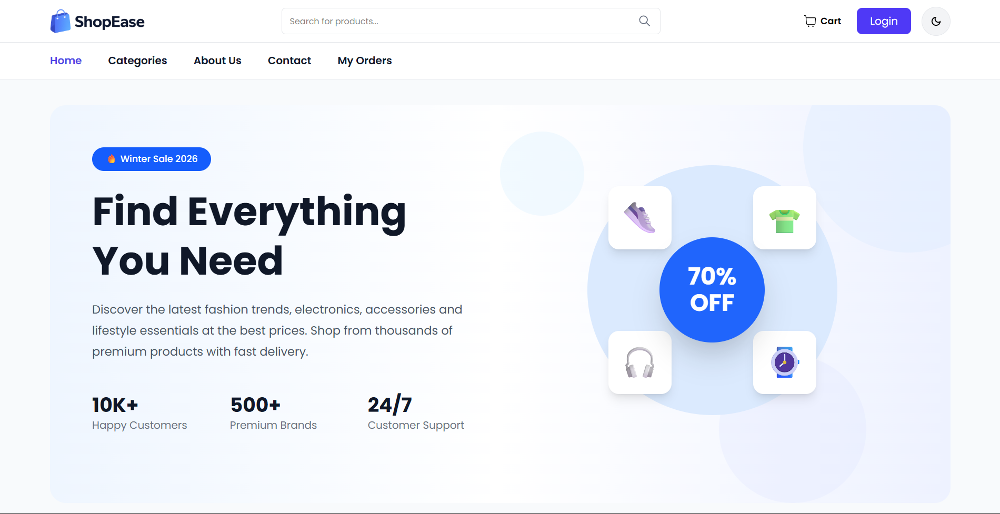
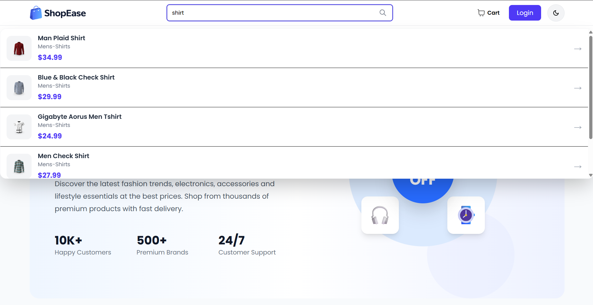
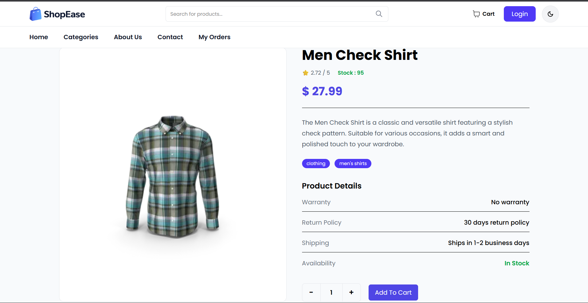
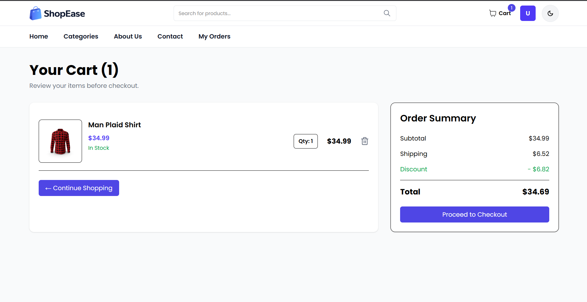
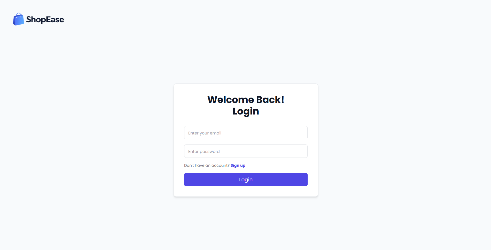
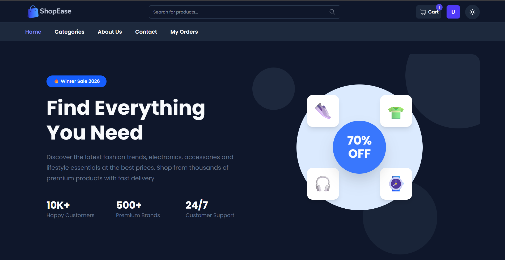

# 🛒 ShopEase

A full-stack e-commerce web application built with the MERN stack. ShopEase provides a seamless shopping experience with secure authentication, product browsing, cart management, and a responsive user interface.

## 🌐 Live Demo

**Website:** https://shopeease-e-commerce.onrender.com

## ✨ Features

* User Authentication (JWT)
* Product Search
* Product Listing
* Single Product Page
* Add to Cart
* Update Cart Quantity
* Checkout
* Dark Mode
* Responsive Design

## 🛠️ Tech Stack

**Frontend**

* React.js
* Vite
* Tailwind CSS
* Redux Toolkit
* React Router
* Axios

**Backend**

* Node.js
* Express.js
* MongoDB
* Mongoose
* JWT
* bcrypt

## 📷 Screenshots

### Home

### Products

### Product Details

### Cart

### Login

### Dark Mode

